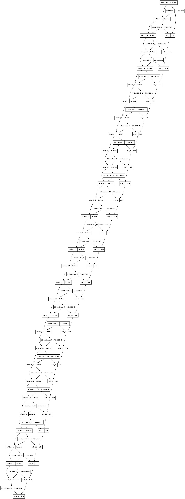
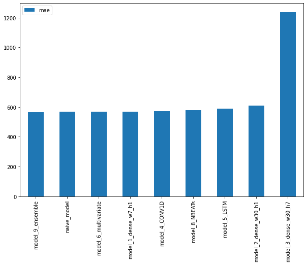
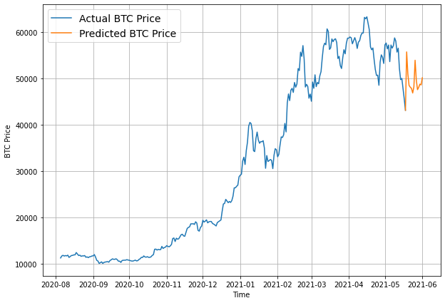

# BitPredict

Building a series of Time-Series models in an attempt to predict the price of Bitcoin including implementing the double residual stacking architecture in the N-BEATS paper

## Modelling Experiments

| Model Number | Model Type                                                       | Horizon size | Window size | Extra data        |
| ------------ | ---------------------------------------------------------------- | ------------ | ----------- | ----------------- |
| 0            | Naïve model (baseline)                                           | NA           | NA          | NA                |
| 1            | Dense model                                                      | 1            | 7           | NA                |
| 2            | Same as 1                                                        | 1            | 30          | NA                |
| 3            | Same as 1                                                        | 7            | 30          | NA                |
| 4            | Conv1D                                                           | 1            | 7           | NA                |
| 5            | LSTM                                                             | 1            | 7           | NA                |
| 6            | Same as 1 (but with multivariate data)                           | 1            | 7           | Block reward size |
| 7            | [N-BEATs Algorithm](https://arxiv.org/pdf/1905.10437.pdf)        | 1            | 7           | NA                |
| 8            | Ensemble (multiple models optimized on different loss functions) | 1            | 7           | NA                |
| 9            | Future prediction model (model to predict future values)         | 1            | 7           | NA                |

## Model_7 Architecture

## Model Results

## Final Prediction

